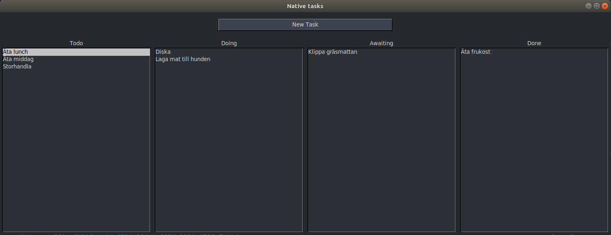

# Todo
Develop a Kanban board where data is stored locally

## Native Python App
The first usable app is made in native python and should be able to run on any os who can run python.

### Hotkeys:
`n, t` = Create new task

`Tab` = Switch between kanban boards

`Arrow keys, down and up` = Move cursor among tasks

`Space` = Select marked task

`Arrow keys, left and right` = Move selected task

`Delete` = Delete selected task

`Esc` = Exit

